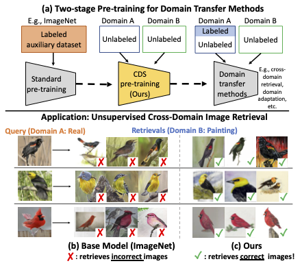

# [CDS: Cross-Domain Self-Supervised Pre-Training (ICCV 2021)](https://openaccess.thecvf.com/content/ICCV2021/papers/Kim_CDS_Cross-Domain_Self-Supervised_Pre-Training_ICCV_2021_paper.pdf)
[Donghyun Kim](http://cs-people.bu.edu/donhk/), [Kuniaki Saito](http://cs-people.bu.edu/keisaito/), [Tae-Hyun Oh](https://ami.postech.ac.kr/), [Bryan A. Plummer](http://bryanplummer.com/), [Stan Sclaroff](https://www.cs.bu.edu/fac/sclaroff/), and [Kate Saenko](http://ai.bu.edu/ksaenko.html)
#### [[Project Page]]()  [[Paper]](https://openaccess.thecvf.com/content/ICCV2021/papers/Kim_CDS_Cross-Domain_Self-Supervised_Pre-Training_ICCV_2021_paper.pdf)



## Introduction

We present Cross-Domain Self-supervised Pretraining (CDS), a two-stage pre-training approach that improves the generalization ability of standard single-domain pre-training. This is an PyTorch implementation of CDS. This implementation is based on [Instance Discrimination](https://github.com/zhirongw/lemniscate.pytorch), [CDAN](https://github.com/thuml/CDAN), and [MME](https://github.com/VisionLearningGroup/SSDA_MME). This repository currently supports codes for experiments for few-shot DA on Office-Home. We will keep updating this repository to support other experiments.

## Directories

[CDS_pretraining](CDS_pretraining): Our implementation of CDS. <br>
[data](data): Datasets (e.g. Office-Home) used in this paper <br> 
[CDAN](CDAN): Implementation borrowed from [CDAN](https://github.com/thuml/CDAN) <br>


## Requirement
Python 3.6.9, Pytorch 1.6.0, Torch Vision 0.7.0. <br>


## Usage

### CDS Pre-training

CDS pretraining on Real and Clipart domains in Office-Home. 
```
cd CDS_pretraining
python CDS_pretraining.py --dataset office_home --source Real --target Clipart
```

### Few-shot DA (1-shot and 3-shots)
```
cd CDAN
python CDAN_fewshot_DA.py --method CDAN+E --dataset office_home --source Real --target Clipart

```


## Reference
This repository is contributed by [Donghyun Kim](http://cs-people.bu.edu/donhk/).
If you consider using this code or its derivatives, please consider citing:

```
@inproceedings{kim2021cds,
  title={CDS: Cross-Domain Self-Supervised Pre-Training},
  author={Kim, Donghyun and Saito, Kuniaki and Oh, Tae-Hyun and Plummer, Bryan A and Sclaroff, Stan and Saenko, Kate},
  booktitle={Proceedings of the IEEE/CVF International Conference on Computer Vision},
  pages={9123--9132},
  year={2021}
}
```

